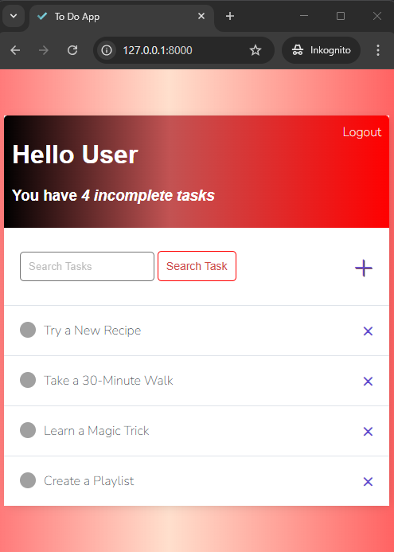

# To-Do-List-App-Django

A simple web-based To-Do List application with user authentication (Login/Register) and task management features.

 <!-- Replace with your actual screenshot paths -->

## Features

### User Authentication
- **Register**: Create a new account with username, password, and password confirmation.
- **Login**: Access your account securely with registered credentials.

### Task Management
- **View Tasks**: See all incomplete tasks on the dashboard (e.g., "You have 5 incomplete tasks").
- **Add Tasks**: Create new tasks with titles and descriptions.
- **Delete Tasks**: Confirm and remove tasks permanently.
- **Search**: Search through tasks using keywords.
- **Task Details**: View detailed descriptions of tasks (e.g., "Take a 30-Minute Walk" with notes).

 ## OVERVIEW
1. **Login Page**:
2. **Registration Page**:
3. **Task Dashboard**:
4. **Task Details**:
5. **Delete Confirmation**:

## Installation

1. **Clone the repository**:
   ```bash
   git clone https://github.com/your-username/todo-app.git
   cd todo-app
2. **Run the application**:
  ```bash
python manage.py runserver


